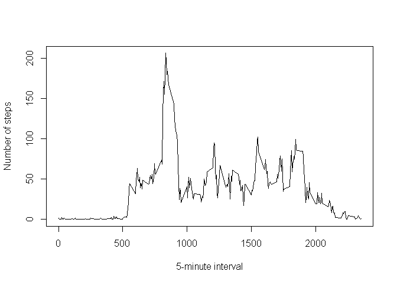
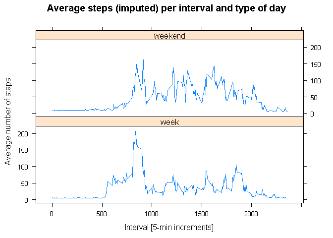

## Loading and preprocessing the data


```r
#Unzip the data folder
zip_in <-  "C:/Users/jorge_000/Desktop/ONLINE_COURSES/DATA_SCIENCE_COURSERA/5_REPROD_RESEARCH/RepData_PeerAssessment1/activity.zip"
zip_out <- "C:/Users/jorge_000/Desktop/ONLINE_COURSES/DATA_SCIENCE_COURSERA/5_REPROD_RESEARCH/RepData_PeerAssessment1/activity"
unzip(zip_in,zip_out)
```


```r
##Read the data
activity <- read.csv("activity/activity.csv",header = TRUE,na.strings = c("NA","<NA>"))

#Visualising the data
str(activity)
```

```
'data.frame':	17568 obs. of  3 variables:
 $ steps   : int  NA NA NA NA NA NA NA NA NA NA ...
 $ date    : Factor w/ 61 levels "2012-10-01","2012-10-02",..: 1 1 1 1 1 1 1 1 1 1 ...
 $ interval: int  0 5 10 15 20 25 30 35 40 45 ...
```

The dataset we are managing contains 17568 obserations of 3 variables. Those are:

- Steps: number of steps taking in a 5-minute interval.

- Date: the date when the measurement was taken in YYYY-MM-DD format.

- Interval: identifier for the 5-minute interval in which measurement was taken.

## What is mean total number of steps taken per day?

### 1. Calculate the total number of steps taken per day

As for this part we can ignore the missing values, we will just eliminate them from our data. Then, to calculate the mean number of steps taken per day, we just need to group the data by the variable "date" and then sum over the number of steps. Then, we can compute the mean of the "steps" column, which averages over the steps taken each day. The median can be calculated as well with the "median" function. 


```r
#Eliminate missing values (NA)
new_activity <- na.omit(activity)

#Calculate the total number of steps taken per day
daily_steps <- new_activity %>%
    group_by(date) %>%
    summarise(steps = sum(steps))

#Calculate and report the mean and median of the total number of steps taken per day
mean_steps <- mean(daily_steps$steps)
median_steps <- median(daily_steps$steps)
cbind(mean_steps = mean_steps, median_steps = median_steps)
```

```
     mean_steps median_steps
[1,]   10766.19        10765
```

### 2. Histogram of the total number of steps per day

We will produce and histogram of daily steps and show the mean value in blue.

```r
hist(daily_steps$steps, xlab = "Number of steps/day", main = "Histogram of daily steps w/o NAs")
abline(v = mean_steps, col = "blue",lwd = 2) 
```

<!-- -->


## What is the average daily activity pattern?

### 1. Make a time series plot of the 5-minute interval (x-axis) and the average number of steps taken, averaged across all days (y-axis)

To do so, we group our dataset with respect to variable "interval" and compute the mean number of steps, which we round to the second decimal value. Then, we make the plot, with the variable "interval"


```r
interval_steps <- new_activity %>%
    group_by(interval) %>%
    summarise(steps = round(mean(steps),2)) %>%
    ungroup() %>%
    as.data.frame()

#Make the plot
with(interval_steps,plot(interval,steps,type = "l",xlab = "5-minute interval", 
     ylab = "Number of steps",main = "Time series of the mean steps per interval"))
```

<!-- -->


### 2. Which 5-minute interval, on average across all the days in the dataset, contains the maximum number of steps?

To answer, we just find the 5-minute interval for which the number of steps is maximum:

```r
index <- which.max(interval_steps$steps)
cbind(interval_index = interval_steps$interval[index], max_steps = interval_steps$steps[index])
```

```
     interval_index max_steps
[1,]            835    206.17
```

## Imputing missing values

### 1. Calculate and report the total number of missing values in the dataset (i.e. the total number of rows with NAs)

To do so, we use the apply function, calculating the number of NAs in each row and summing over the resulting vector.


```r
sum(apply(activity,1,function(x){sum(is.na(x))}))  
```

```
[1] 2304
```

### 2. Devise a strategy for filling in all of the missing values in the dataset. 

**1. We try as strategy replacing the NAs by the mean of that day:**

To do so, we will use the activity dataframe, group it by the "date" variable and then compute the mean number of steps each day. Then, we will merge the resulting dataframe with activity in order to obtain a column with the mean number of steps each day. Having the correct dimensions, we will substitute the NA values in activity by the corresponding mean values calculated.


```r
#We check which columns in the activity dataframe contain missing values
apply(activity,2,function(x){sum(is.na(x))})
```

```
   steps     date interval 
    2304        0        0 
```

```r
#Create a copy of activity to work on it
activity2 <- activity

#Mean by day
mean_by_day <- activity2 %>%
    group_by(date) %>%
    summarise(mean_steps = mean(steps,na.rm =TRUE))

#We see we still have NA values for particular days (E.g.: 2012-10-01) where we only have NA values, such that the function cannot compute a mean value. We substitute them by 0s

mean_by_day$mean_steps[is.na(mean_by_day$mean_steps)] <- 0

#Now we merge activity2 with mean_by_day and rename the columns
merged_data <- merge(activity2,mean_by_day,by = "date")
names(merged_data) <- c("date","steps","interval","mean_steps_day")
head(merged_data,10)
```

```
         date steps interval mean_steps_day
1  2012-10-01    NA        0              0
2  2012-10-01    NA        5              0
3  2012-10-01    NA       10              0
4  2012-10-01    NA       15              0
5  2012-10-01    NA       20              0
6  2012-10-01    NA       25              0
7  2012-10-01    NA       30              0
8  2012-10-01    NA       35              0
9  2012-10-01    NA       40              0
10 2012-10-01    NA       45              0
```

**2. We try as strategy replacing the NAs by the mean of that 5-minute interval:**

We basically do the same as above, but we use the "interval_steps" variable we computed above. Then, we merge the data and perform the substitution as before.


```r
#We create a copy of activity to work with it
activity3 <- activity

#We compute the mean of each interval ignoring the NA values:
merged_data2 <- merge(activity3,interval_steps,by = "interval")
names(merged_data2) <- c("interval","steps","date","average_interval")
head(merged_data2)
```

```
  interval steps       date average_interval
1        0    NA 2012-10-01             1.72
2        0     0 2012-11-23             1.72
3        0     0 2012-10-28             1.72
4        0     0 2012-11-06             1.72
5        0     0 2012-11-24             1.72
6        0     0 2012-11-15             1.72
```

### 3. Create a new dataset that is equal to the original dataset but with the missing data filled in.

We create a new dataset "activity2" with the NAs replaced by the mean steps of that day:

```r
#Now we add the mean steps per day rows to the same rows in activity2 which have NA values
activity2$steps[is.na(activity2$steps)]<- merged_data$mean_steps_day[is.na(activity2$steps)]
head(activity2,10)
```

```
   steps       date interval
1      0 2012-10-01        0
2      0 2012-10-01        5
3      0 2012-10-01       10
4      0 2012-10-01       15
5      0 2012-10-01       20
6      0 2012-10-01       25
7      0 2012-10-01       30
8      0 2012-10-01       35
9      0 2012-10-01       40
10     0 2012-10-01       45
```

```r
#Finally, we check that there are no more NA values in the "steps" column
sum(is.na(activity2$steps)) #No more NA values left
```

```
[1] 0
```

We create a new dataset "activity3" with the NAs replaced by the mean steps of that 5-minute interval:

```r
#We replace the missing values (NAs) in activity3
activity3$steps[is.na(activity3$steps)] <- merged_data2$average_interval[is.na(activity3$steps)]
head(activity3,10)
```

```
   steps       date interval
1   1.72 2012-10-01        0
2   1.72 2012-10-01        5
3   1.72 2012-10-01       10
4   1.72 2012-10-01       15
5   1.72 2012-10-01       20
6   1.72 2012-10-01       25
7   1.72 2012-10-01       30
8   1.72 2012-10-01       35
9   1.72 2012-10-01       40
10  1.72 2012-10-01       45
```

```r
#We check that there are no more NA values
sum(is.na(activity3$steps))
```

```
[1] 0
```

### 4.1 Pot an histogram of the total number of steps taken per day and report the mean and the median.

We will plot 2 histograms: one for each of the procedures we employed for imputing NA values.

We report the mean and the median number of steps for the first case:


```r
#We calculate the total number of steps per day in the activity2 dataframe, which has the mean number of steps of a date instead of NA values
total_steps <- activity2 %>%
    group_by(date) %>%
    summarise(steps = sum(steps))

#Compute the mean and the median number of steps
total_mean_steps <- mean(total_steps$steps,na.rm = TRUE)
total_median_steps <- median(total_steps$steps)
cbind(mean_steps = total_mean_steps,median_steps = total_median_steps)
```

```
     mean_steps median_steps
[1,]    9354.23        10395
```

We report the mean and the median number of steps for the second case:

```r
#We calculate the total number of steps per day in the activity3 dataframe, which has the mean number of steps of a 5-minute interval instead of NA values
total_steps2 <- activity3 %>%
    group_by(date) %>%
    summarise(steps = sum(steps))
total_mean_steps2 <- mean(total_steps2$steps)
total_median_steps2 <- median(total_steps2$steps)
cbind(mean_steps = total_mean_steps2,median_steps = total_median_steps2)
```

```
     mean_steps median_steps
[1,]   10889.78        11015
```

Now we plot both histograms and compare them to the original histrogram calculated for the case where NA values were just ignored.


```r
par(mfrow = c(1,3))

#Plot an histogram of number of steps ignoring NAsand show the mean in blue
with(daily_steps,hist(steps, xlab = "Number of steps/day", main = "Daily steps w/o NAs"))
abline(v = mean_steps, col = "blue",lwd = 2)

#Plot an histogram of number of steps substituting NAs by the daily mean and show the mean in blue
with(total_steps,hist(steps,xlab = "Number of steps", main = c("Daily steps filling NAs with the","daily mean")))
abline(v = total_mean_steps, col = "blue",lwd = 2)

#Plot an histogram of number of steps substituting NAs by the mean of 5-minute interval and show the mean in blue
with(total_steps2,hist(steps,xlab = "Number of steps",main = c("Daily steps filling NAs with the","5-minute interval mean")))
abline(v = total_mean_steps2,col = "blue",lwd = 2)
```

<!-- -->


### 4.2 Do these values differ from the estimates from the first part of the assignment? 

If we refer to ignoring NAs as strategy "A", replacing them by the daily mean, "B" and replacing them by the 5-min interval mean, "C", we get the following:

replacement of NAs by the daily mean "B"

```r
cbind(mean_A = mean_steps,mean_B = total_mean_steps, mean_C = total_mean_steps2,median_A = median_steps, median_B = total_median_steps, median_C = total_median_steps2)
```

```
       mean_A  mean_B   mean_C median_A median_B median_C
[1,] 10766.19 9354.23 10889.78    10765    10395    11015
```

Judging from the histograms and the tables above, we see that imputing NA values makes the estimates of the mean and the median vary. 

### 4.3 What is the impact of imputing missing data on the estimates of the total daily number of steps?

Strategy "B" is the worst, as we see that the distribution of number of steps is deeply changed with respect to that of case "A", when we ignored NA values. However, substituting NAs by the mean of a certain 5-minute interval results in a very similar distribution with a very close mean and median estimates.

## Are there differences in activity patterns between weekdays and weekends?

For this part, we are required to use the dataset with imputed missing values. Therefore, we will employ the "activity3" dataset, where NAs were substituted with the mean number of steps of a 5-min interval.

### 1. Create a new factor variable in the dataset with two levels – “weekday” and “weekend” indicating whether a given date is a weekday or weekend day


```r
activity3$weekdays <- weekdays(as.POSIXct(activity3$date))
activity3$weekdays <- ifelse(activity3$weekdays == "sábado"| activity3$weekdays == "domingo","weekend","week")
table(activity3$weekdays) 
```

```

   week weekend 
  12960    4608 
```

### 2. Make a panel plot containing a time series plot of the 5-minute interval (x-axis) and the average number of steps taken, averaged across all weekday days or weekend days (y-axis)


```r
average_weekdays <- activity3 %>%
    group_by(interval,weekdays) %>%
    summarise(mean_steps = mean(steps))

#We use the lattice plot package, as the figure in GitHub is built that way
xyplot(mean_steps~interval|weekdays,data=average_weekdays,type="l",layout = c(1,2),
       main="Average steps (imputed) per interval and type of day",
       ylab="Average number of steps",xlab="Interval [5-min increments]")
```

<!-- -->


